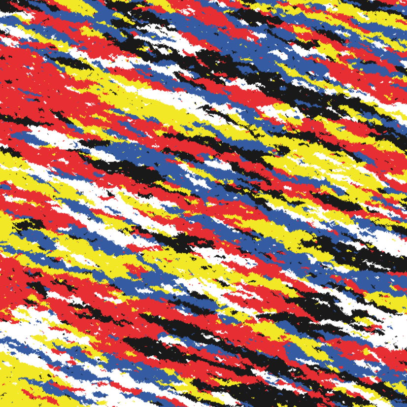
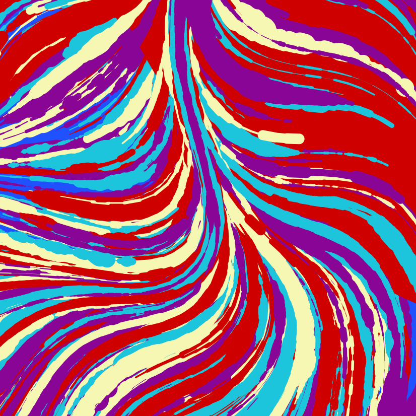

```{r setup, include=FALSE}
knitr::opts_chunk$set(echo = FALSE)
```

Hi! Welcome to my website for MATH230 Final Project.

```{r}
print("Hello!!")
```


#TODO: checkout plotly (it can serve as a new plot we haven't done and it can add interactive things)

<!--chapter:end:index.Rmd-->

---
title: "Untitled"
author: "Nick Huo"
date: "`r Sys.Date()`"
output: html_document
---

```{r setup, include=FALSE}
knitr::opts_chunk$set(echo = TRUE)
```

## R Markdown

This is an R Markdown document. Markdown is a simple formatting syntax for authoring HTML, PDF, and MS Word documents. For more details on using R Markdown see <http://rmarkdown.rstudio.com>.

When you click the **Knit** button a document will be generated that includes both content as well as the output of any embedded R code chunks within the document. You can embed an R code chunk like this:

```{r cars}
summary(cars)
```

## Including Plots

You can also embed plots, for example:

```{r pressure, echo=FALSE}
plot(pressure)
```

Note that the `echo = FALSE` parameter was added to the code chunk to prevent printing of the R code that generated the plot.

<!--chapter:end:1.Rmd-->

---
title: "Past Course Visualizations"
description: |
  Some additional details about the website
site: distill::distill_website
---

```{r setup, include=FALSE}
knitr::opts_chunk$set(echo = FALSE)
```

## Generative Art

The pictures below are artworks generated using the `aRtsy` [package](https://github.com/koenderks/aRtsy), which uses some algorithms with certain parameter and randomization settings to generate beautiful pieces autonomously.

{width="80%"}

*Space Camo, 2022*

{width="80%"}

*Titan Wave, 2022*

{width="80%"}

*Outer Land, 2022*

## Confidence Interval Plots & Interactive Shiny Visualizations

{width="85%"}

Here is a plot showing the effects of the confidence level on width of confidence intervals. We have randomly selected 6 from 10000 randomly simulated samples, and we will see that adjusting the confidence level higher will result in wider intervals, vice versa. In the top interval, with its sample mean, we can see that when confidence level is 80%, the reduced interval width caused it to almost miss the true population mean.

So, with the same sample means, changing the confidence level will result in different interval widths; consequently, lower confidence levels means less intervals in repeated sampling will successfully capture the true population mean -- the sample means remain the same, but different confidence level results in different widths that may or may not capture the true population mean.

[Link to Interactive APP:]{.ul}

<https://rconnect.bucknell.edu/content/c9c7fa3a-0fbf-4c42-b4e7-19e6950f0564>

<!--chapter:end:course_visualizations.Rmd-->

---
title: "Final Project - Data Story"
description: |
  Welcome to the website. I hope you enjoy it!
site: distill::distill_website
---

```{r setup, include=FALSE}
knitr::opts_chunk$set(echo = FALSE)
```

## Generative Art

The pictures below are artworks generated using the `aRtsy` [package](https://github.com/koenderks/aRtsy), which uses some algorithms with certain parameter and randomization settings to generate beautiful pieces autonomously.

{width="80%"}

*Space Camo, 2022*

{width="80%"}

*Titan Wave, 2022*

{width="80%"}

*Outer Land, 2022*

## Confidence Interval Plots & Interactive Shiny Visualizations

{width="85%"}

Here is a plot showing the effects of the confidence level on width of confidence intervals. We have randomly selected 6 from 10000 randomly simulated samples, and we will see that adjusting the confidence level higher will result in wider intervals, vice versa. In the top interval, with its sample mean, we can see that when confidence level is 80%, the reduced interval width caused it to almost miss the true population mean.

So, with the same sample means, changing the confidence level will result in different interval widths; consequently, lower confidence levels means less intervals in repeated sampling will successfully capture the true population mean -- the sample means remain the same, but different confidence level results in different widths that may or may not capture the true population mean.

[Link to Interactive APP:]{.ul}

<https://rconnect.bucknell.edu/content/c9c7fa3a-0fbf-4c42-b4e7-19e6950f0564>

<!--chapter:end:data_story.Rmd-->

---
title: "Final Project - Data Story"
description: |
  Welcome to the website. I hope you enjoy it!
site: distill::distill_website
---

```{r setup, include=FALSE}
knitr::opts_chunk$set(echo = TRUE)

# Learn more about creating websites with Distill at:
# https://rstudio.github.io/distill/website.html
```

## Loading Packages
```{r}
library(data.table)
library(ggplot2)
library(ggthemes)
library(plotly)
```


## Importing Dataset
```{r}

used_cars <- fread("true_car_listings.csv")

# Removing variables that I won't use
used_cars <- subset(used_cars, select = -c(City, Vin, Model))

str(used_cars)
```

## Data Cleaning

Change Year to factor and removing Year 2018 because of possibly incomplete data (2018 not done yet) 

```{r}
used_cars$Year <- factor(used_cars$Year, ordered = T)
used_cars <- used_cars[Year != 2018,]
summary(used_cars$Year)
```


Fix bad state names

```{r}
wrong_state_names <- c("Az", "Ca", "Fl", "ga", "Ga", "Md", "Oh", "Va")
full_idx <- c()
for (bad_state in wrong_state_names) {
    tmp_idx <- which(used_cars$State == "AZ")
    full_idx <- c(full_idx, tmp_idx)
}

for (row_num in full_idx) {
    if (used_cars[row_num, "State"] %in% wrong_state_names) {
        used_cars[row_num, "State"] <- toupper(used_cars[row_num, "State"])
    }
}

used_cars$State <- factor(used_cars$State)
#summary(used_cars$State)
```


```{r}

```


```{r}
set.seed(233)
PA_cars <- used_cars[used_cars$State=="PA"]
#sample_index <- sample(nrow(PA_cars),1000)
PA_sample_index <- sample(nrow(PA_cars),300)
PA_sample <- PA_cars[PA_sample_index]

NY_cars <- used_cars[used_cars$State=="NY"]
NY_sample_index <- sample(nrow(NY_cars),300)
NY_sample <- NY_cars[NY_sample_index]

NJ_cars <- used_cars[used_cars$State=="NJ"]
NJ_sample_index <- sample(nrow(NJ_cars),300)
NJ_sample <- NJ_cars[NJ_sample_index]

AL_cars <- used_cars[used_cars$State=="AL"]
AL_sample_index <- sample(nrow(AL_cars),300)
AL_sample <- AL_cars[AL_sample_index]

#sample_df <- rbind(PA_sample,NY_sample) 
#sample_df <- rbind(sample_df, NJ_sample)
#sample_df <- rbind(sample_df, AL_sample)

sample_df <- rbind(PA_sample,AL_sample)

summary(sample_df)
```

I will use mainly the price, year, mileage, state, and make variables.

1. year & mileage on price.

2. Price distribution by state

3. Mean price by year [scatter or line plot]

4. Mean price by state (map) [bubble, price=size of bubble]

5. Distribution (violin or box) of mean prices from each state, by year.


###Some Testing
```{r}
library(plotly) 

p0 <-ggplot(sample_df) +
    geom_histogram(aes(x=Price, y = ..density.., fill=State), bins = 29, alpha=0.6) +
    geom_density(aes(x=Price, color=State)) + 
    #ylim(0, 5) +
    xlab("Price ($)") +
    labs(title="Distribution of Prices of PA vs AL", fill="State")

ggsave("price_dist_by_state.png")


ggplotly(p0) %>% 
    layout(plot_bgcolor='#e5ecf6',   
           xaxis = list(   
               title='Price ($)', 
               zerolinecolor = '#ffff',   
               zerolinewidth = 2,   
               gridcolor = 'ffff'),   
           yaxis = list(   
               title='Density', 
               zerolinecolor = '#ffff',   
               zerolinewidth = 2,   
               gridcolor = 'ffff'),
           title = 'Histogram and Density Plot of Prices by State') 
```


test
```{r}
#creating a dummy data table
DT <- data.table( ID = 1:50,
                Capacity = sample(100:1000, size = 50, replace = F),
                Code = sample(LETTERS[1:4], 50, replace = T),
                State = rep(c("Alabama","Indiana","Texas","Nevada"), 50))

#simple data.table command
DT[Code == "C", mean(Capacity), State]
```


```{r}
p1 <- ggplot(PA_sample, aes(x=Year, y=Mileage)) +
    #geom_tile(aes(fill = Price)) +
    geom_point(aes(size=Price)) +
    scale_fill_distiller(palette = "YlGnBu", direction = 1) +
    theme_light() +
    labs(title = "Price",   y = "Mileage")

p1
#ggplotly(p1)

p2 <- ggplot(NY_sample, aes(x=Year, y=Mileage)) +
    #geom_tile(aes(fill = Price)) +
    geom_point(aes(size=Price)) +
    scale_fill_distiller(palette = "YlGnBu", direction = 1) +
    theme_light() +
    labs(title = "Price",   y = "Mileage")
p2
#ggplotly(p2)

p3 <- ggplot(NJ_sample, aes(x=Year, y=Mileage)) +
    #geom_tile(aes(fill = Price)) +
    geom_point(aes(size=Price, fill=State)) +
    scale_fill_distiller(palette = "YlGnBu", direction = 1) +
    theme_light() +
    labs(title = "Price",   y = "Mileage")
#p3
#ggplotly(p3)

p4 <- ggplot(sample_df, aes(x=Year, y=Mileage)) +
    #geom_tile(aes(fill = Price)) +
    geom_point(aes(size=Price, color=State)) +
    #scale_fill_distiller(palette = "YlGnBu", direction = 1) +
    #theme_light() +
    labs(title = "Price ($)",   y = "Mileage (Mi)") +
    ggtitle("Price by Year and Mileage, grouped by States")
p4
ggsave("price_by_year_&_mileage.png")
```


```{}
fig <- plot_ly(sample_df, x = ~Year, y = ~Mileage, text = ~Make, type = 'scatter', mode = 'markers', color = ~Price, colors='Reds' , marker = list(size = ~Price, opacity = 0.5))
fig <- fig %>% layout(title = 'Price by Year and Mileage, grouped by States',
                      xaxis = list(showgrid = FALSE),
                      yaxis = list(showgrid = FALSE))
fig
```

```{}
library(ggplot2)
library(ggradar)
suppressPackageStartupMessages(library(dplyr))
library(scales)

%>%
add_rownames( var = "group" ) %>%
mutate_each(funs(rescale), -group) %>%
tail(4) %>% select(1:10) -> mtcars_radar bv

ggradar(mtcars_radar) 
```


```{r}
mean_prices_all_states <- c()

for (i in 1997:2018) {
    print(i)
    print(mean(used_cars$Price[used_cars$Year==i]))
    mean_prices_all_states <- c(mean_prices_all_states, mean(used_cars$Price[used_cars$Year==i]))
}

mean_prices_by_year <- data.frame(list(Mean_Price=mean_prices_all_states,Year=1997:2018))


mean_prices_all_states

used_cars[,mean(Price), Year]

ggplot(mean_prices_by_year, aes(x=Year, y=Mean_Price)) +
    geom_point() +
    geom_smooth() +
    ggtitle("Mean Price by Year") +
    xlab("Year") +
    ylab("Price ($)")
ggsave("mean_price_by_year.png")
```


```{r}
mean_prices_by_states <- c()

states <- rep(unique(used_cars$State), times=length(1997:2018))
years <- rep(1997:2018, each=length(unique(used_cars$State)))
mean_price <- rep(0,length(years))
mean_prices_by_year_n_state <- data.frame(states, years,mean_price)


for (i in 1:nrow(mean_prices_by_year_n_state)) {
    this_state <- mean_prices_by_year_n_state[i,1]
    this_year <- mean_prices_by_year_n_state[i,2]
    this_mean_price <- mean(used_cars$Price[used_cars$Year==this_year & used_cars$State==this_state])
    mean_prices_by_year_n_state[i,3] <- this_mean_price
}

used_cars[,State, Year]

all_data <- data.table()
for (i in 1997:2018) {
    states_mean <- used_cars[Year==i, mean(Price), State]
    setnames(states_mean, 'V1', 'mean_price')
    with_year <- data.table(rep(i, times=nrow(states_mean)), states_mean)
    setnames(with_year, 'V1', 'years')
    all_data <- rbind(all_data, with_year)
}
all_data[1183,]
```


```{r}
p10 <- ggplot(mean_prices_by_year_n_state, aes(x=years, y=mean_price, color=states)) +
    geom_point() +
#    geom_smooth() +
    ggtitle("Mean Price by Year and State") +
    xlab("Year") +
    ylab("Price ($)")
ggplotly(p10)

all_data
p11 <- ggplot(all_data, aes(x=years, y=mean_price, color=State)) +
    geom_point() +
#    geom_smooth() +
    ggtitle("Mean Price by Year and State") +
    xlab("Year") +
    ylab("Price ($)")
p11

ggplotly(p11)
```


```{r}
for (i in levels(used_cars$State)) {
    print(i)
    print(nrow(used_cars[State==i & Year==1997]))
}


```


make by state

south -> american 

<!--chapter:end:workbook.Rmd-->

