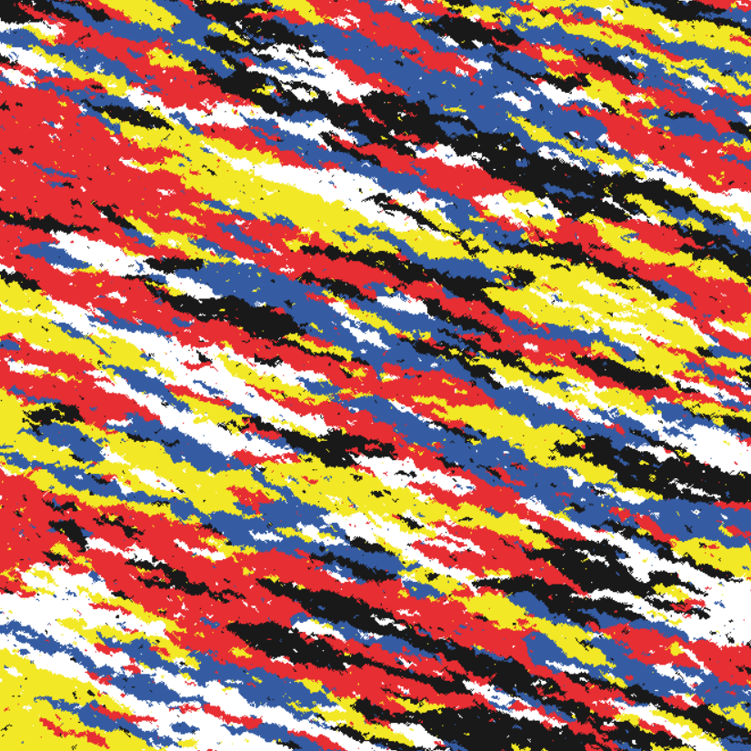
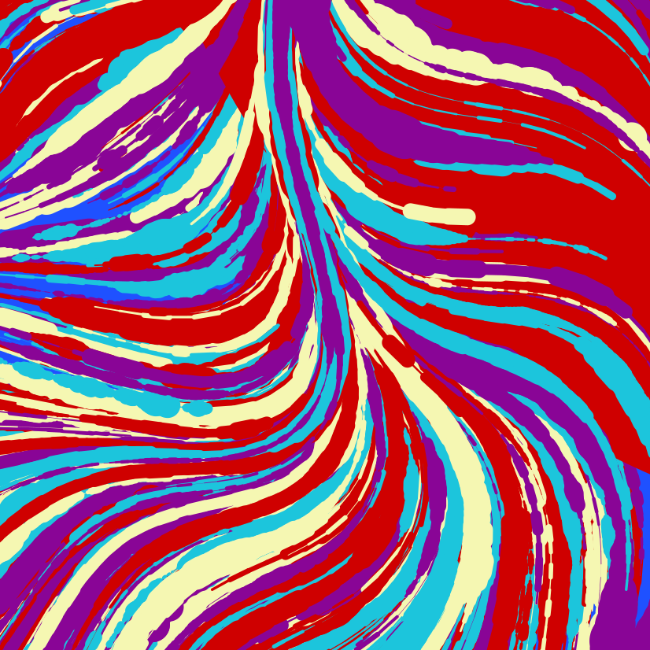
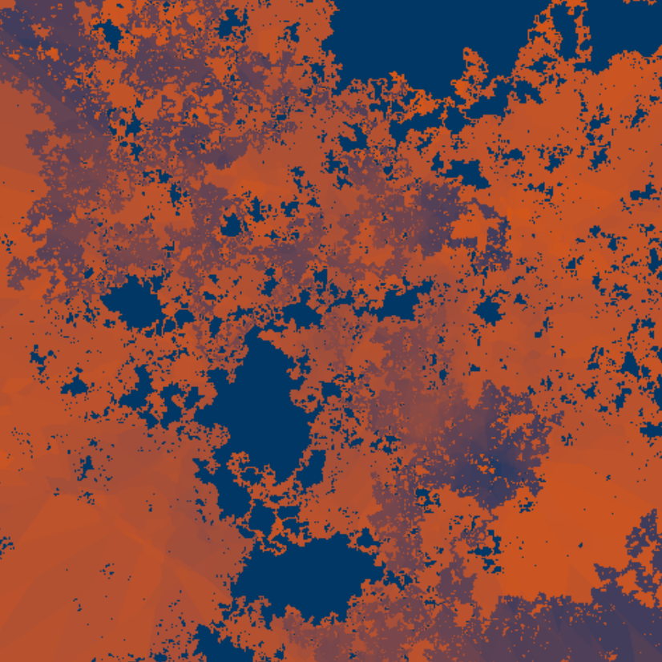
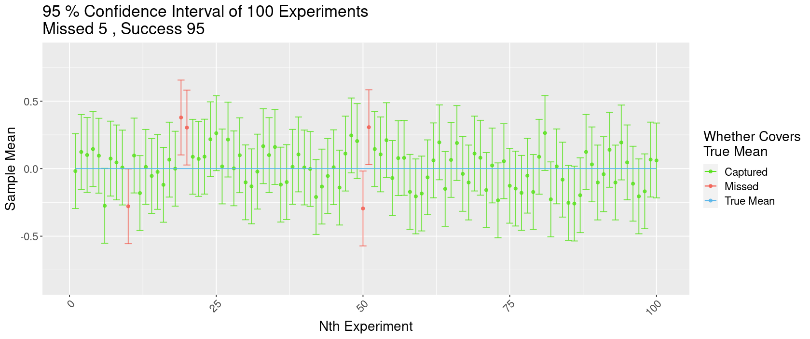
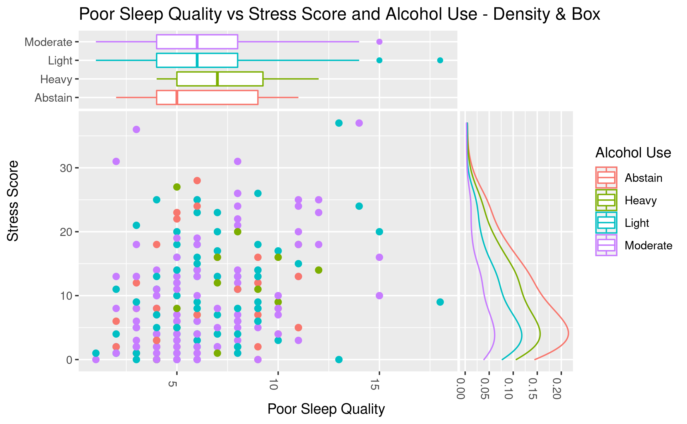

```{r setup, include=FALSE}
knitr::opts_chunk$set(echo = FALSE)
```

## Generative Art

The pictures below are artworks generated using the `aRtsy` [package](https://github.com/koenderks/aRtsy), which uses some algorithms with certain parameter and randomization settings to generate beautiful pieces autonomously.

{width="80%"}

*Space Camo, 2022*

{width="80%"}

*Titan Wave, 2022*

{width="80%"}

*Outer Land, 2022*

## Confidence Interval Plots & Interactive Shiny Visualizations

####  [Link to Interactive APP]{.underline}

<https://rconnect.bucknell.edu/content/c9c7fa3a-0fbf-4c42-b4e7-19e6950f0564>

#### 



#### 95% Confidence Interval of 100 Experiments

Here is a plot showing the effects of the confidence level on the proportion of intervals that would successfully capture the true mean and the width of confidence intervals. We have randomly generated 100 samples with normal distribution, mean=0, SD=1, and sample size=50. Since our sample are randomly generated, we know what the true "population" mean is -- here being 0 since all the samples were generated under $\mathcal{N}(0,1)$. In these 100 samples, all but 5 of them successful captured the true mean. In the interactive version of this plot, you could adjust the confidence level and notice that the intervals would become wider as confidence level increases, and vice versa. For a 95% confidence interval, we would expect only 95% samples, in repeated sampling, to be able to produce intervals that captures the true mean. And this is exactly what we are see here with our generated "samples" and intervals.

#### 

{width="90%"}

#### Poor Sleep Quality vs Stress Score and Alcohol Use - Density & Box

This is a plot Gabby, Grace, and I created for our ggplot extensions project. Our package was `ggside` , which allows us to see information (for example, the distribution) regarding a single axis in a bivariate plot like this scatter plot shown above. We used the `Lock5Data` datasets package and the `SleepStudy` dataset in it. This dataset contains observations about the sleep patterns of college students with a sample size of 253. In this plot, we used *PoorSleepQuality* and *StressScore* variables and scattered them, while also using *AlcoholUse* to group the observations. The top side is showing a boxplot of *PoorSleepQuality* in each *AlcoholUse* level; the right side is showing the density curves of *StressScore* grouped by *AlcoholUse* level. We are trying to see if stress scores might be correlated with poor sleep quality -- so the more stressed a person is, the worse their sleep quality is; or the worse they sleep, the more stressed they are. We also also interesting to see if alcohol use was a factor in here, since we hypothesized that more alcohol use would lead to both higher stress score and worse sleep quality (meaning a higher "poor sleep quality"). The results, however, are not indicating a correlation between *PoorSleepQuality* vs *StressScore* for students in every alcohol consumption level. But, we still found something interesting thanks to the ggside extension. The boxplot on *PoorSleepQuality* indicates that students who don't drink any alcohol (Abstain) has the lowest median *PoorSleepQuality*, while those who drink heavily has the highest median *PoorSleepQuality*. This means that those who don't drink at all has the better sleep quality and drinking even "lightly" would result in worse sleep quality, while drinking heavily would really hurt their sleep quality.
