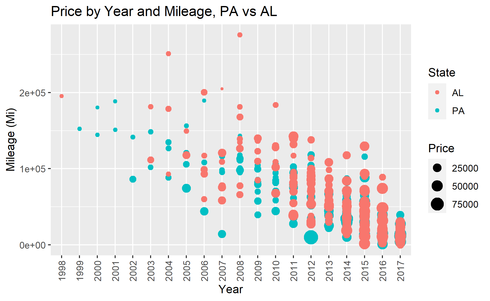
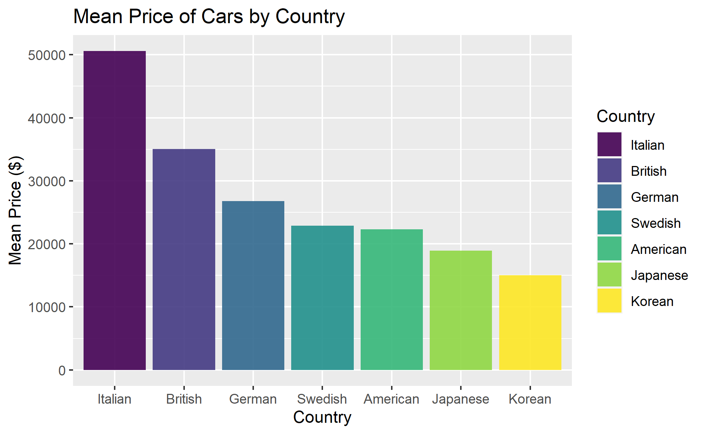
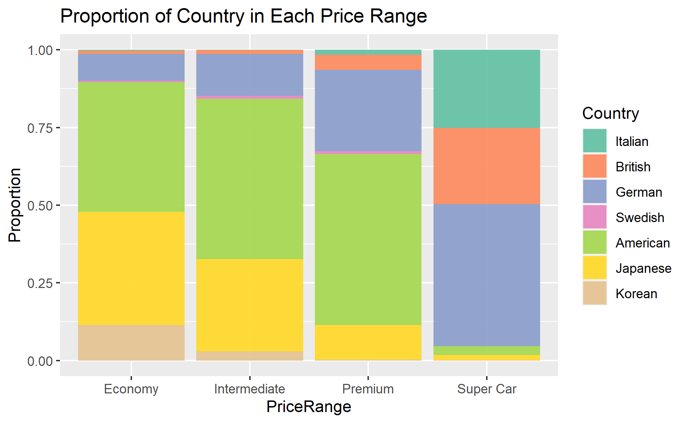

```{r setup, include=FALSE}
knitr::opts_chunk$set(echo = FALSE)
```

# Introduction

I was able to find this very interesting dataset on Kaggle ([Source](https://www.kaggle.com/datasets/harikrishnareddyb/used-car-price-predictions)) on used car listings. It has over 850K entries and it's variables include: *Vin*, *Price*, *Year*, *Mileage*, *City*, *State*, *Make*, and *Model*! So one row of data would be one car listing with information on its *Vin*, *Price*, *Year*, *Mileage, Make, and Model* and the location (where the car is currently located for sale). After looking at the data though, it seems that *Vin*, *City*, and *Model* are too specific to create interesting visualizations, so I will mainly focus on the relationships between *Price*, *Year*, *Mileage*, *City*, *State*, and *Make* in this data story.

The data in this dataset is recorded at some point in 2018, thus all of the car listings have manufactured year up to 2018. But also because of this fact, many states had very few listings for 2018 cars, I determined that there were not enough representative samples for every state. So I decided to ignore 2018 cars in this dataset as well.

I have also included another page called Data Story Workbook on the top right corner of the website, where you can find all my code used to process the data and generate the graphs!

<br>

# Data Story

We begin with one common belief: usually newer cars are more expensive, so those manufactured in earlier years and has more mileage on them should sell for lower prices. We now check out this plot below to confirm that.

{width="90%"}

### Price by Year and Mileage, PA vs AL

In this plot, I decided to look at the relationship between price and year and mileage in two states: PA and AL. I chose them because of the rumor that AL usually have higher used car prices, possibly because of its remote geographical location. For the convenience of visibility I took 300 random samples in each state's listings and plotted them in this scatter plot. The first thing one could notice is this roughly linear relationship between Year and Mileage -- as the used car gets older, it is also more likely that it had been driven for more miles. Each dot represents one observation, and the size of the dot represents the price of that car. We are seeing quite clearly that towards the lower right corner, we generally see larger dots because those cars are newer and have less mileages; while towards the upper left corner (where cars are older and driven for more mileages) the dots are generally smaller. The red color, which represents listings in AL, do not appear to show significantly larger dots than the blue dots (representing PA), except for maybe a few extreme observations. So I think the rumor is not quite true.

<br>

<br>

<iframe src="mean_price_by_year_and_state.html" width="380" height="400">

</iframe>

### Mean Price by Year and State

In this plot, we just look at the mean price of cars made in each year (1997 to 2017). But the focus is now on the different states. Although it might appear messy at first, this plot is in fact interactive, and you can double click on the legend to isolate any single state's data. We also can see the overall trend that newer cars are generally more expensive, but there is also an interesting thing happening -- some 1997 cars are more expensive then 2000 cars. I think this might be because of some of those really old cars has some antique or collection value. If you select only two or three states, you would also be able to compare the mean prices. Some states, like VT, has overall cheaper used car listing prices, so cars have a mean price lower than other states for cars made almost every year (1997 to 2017).

<br>

<br>

While we are still at comparing the mean price of used cars for each state, maybe it will be easier to see them on a map. Could it be possible that some regions have more expensive cars because of some geographical region?

<iframe src="map_mean_price.html" width="380" height="400">

</iframe>

### 2018 US Used Cars -- Mean Listing Price by State

Here in this interactive map plot, you can hover on each state to see more detailed information on that state's used car listings. Colors indicate mean prices. But just on the first glance, there doesn't appear to be some geographical factor involved by a lot. States in the Midwest has slightly higher prices, but not by a large amount, compared to States on the East. The difference in color (signifying mean listing price) are also small.

<br>

<br>

Now what if we want to see the preference in make for each state? I have also heard of rumors that people in the South prefer American cars more, is that true?

<iframe src="map_fav_make.html" width="380" height="400">

</iframe>

### 2018 US Used Cars -- Favorite Make by State

Now, the color for each state represents the most frequent make in the listings of that state. We can see that, contrary to the rumor, the majority of US states in fact love American cars like Ford and Chevrolet. While Japanese makes are only the most popular in a few states. And there is only one state (actually not a state) -- Washington DC that has BMW as its favorite make. You have to zoom in a lot on the map to see the DC region and its brown color.

<br>

<br>

Enough of looking at states. I always wondered if it is actually true that European cars are luxury and expensive, while Asian cars are cheap and economic. Let's look at the distributions of prices and the market shares of cars made by different country at different prices.

While my initial dataset doesn't contain a column that tells me what country that make is from, that is not too hard to look up. So I then categorized all those makes by their originating country.

{width="90%"}

### Distribution of Prices by Country

In this histogram, we are seeing that the majority of used car listings have prices below \$50000. It has a uni-modal distribution with right-skew. The mode appears to be at around \$17000. Note that I only zoomed into the portion where prices below \$100,000, since there are so few listings beyond that. It was actually quite surprising seeing that Japanese cars have such market share at this price range. But still, like what we have seen in the previous map plot, American makes are the most predominant ones. It also appears that Korean cars are quite rare, although also aimed at the cheaper, economical market.

<br>

<br>

If we focus on some specific market types (like exotic sport cars), maybe we get to see more rarer makes like Italian and British cars.

{width="90%"}

### Mean Price of Cars by Country

Here, we focus on listings of cars manufactured by makes from these countries. I have put the mean price of make by each country in order so that we could see the trend easier. Italian and British cars are very rare and they have the highest mean prices. It also appears that German cars are aimed at more a more luxury market, somewhat above Swedish and American cars. And just like what we have confirmed previously, Japanese and Korean cars are the cheapest.

<br>

<br>

To better show the market share of different make's country, I also categorized Price into 4 categories: Economy (Price below \$20,000), Intermediate (Price between \$20,000 and \$40,000), Premium (Price between \$40,000 and \$100,000), and Super Car (Price above \$100,000).

{width="90%"}

### Proportion of Country in Each Price Range

This is my favorite plot! We are seeing different make and country's market aim much better. While we saw almost zero Italian cars and little British cars in previous plots (because of their rarity), we see that they are very popular for super cars! German cars then made up about 40% of the rest of the super cars, with very little American and Japanese cars in super cars. The most interesting thing is seeing that Japanese and Korean cars decrease in proportion as price range gets higher. This just shows their market aim towards the economic side. American cars have pretty good market share in most price ranges except in super cars -- they are solid for sure. Exotic cars, like Italian, British, or German made, increases in proportion drastically for higher price ranges! And, one last notice: Swedish cars are just rare overall. They have little market share in all price ranges.

<br>

To give a quick summary of this data story. We have looked at several factors that are involved in the pricing of a used car. Its age and mileage are important for sure, but also exotic cars (like Italian or German made) usually have much higher price in general. In terms of market shares though, these exotic cars make up most of the super cars (Price\>\$100K), but these cars only made up a tiny portion of the entire market. Japanese and Korean cars, on the other hand, focuses on the cheaper side of the market, and we also see them having quite large market shares in those markets they aimed for. Lastly, American cars are the most solid cars in the market, being the predominant make in almost all states and in almost all market except for super cars. We have also looked up whether every state are a lot different in their preferences for cars' make or in price. But we notice that they are actually quite similar since they almost all like American cars. And their mean prices quite similar in general, with minor noticeable differences.
